# Ops Pilot

Ops Pilot is an LLM-backed AI pilot planner for small teams. It ingests workflow notes and lightweight metrics, retrieves supporting evidence, scores business value, and generates a one-page pilot brief with ROI, KPIs, risks, rollout steps, and a recommendation on whether the workflow is worth automating. It also supports a post-pilot review mode that compares projected KPI targets against measured pilot results and recommends whether to scale, revise, or stop.

## Highlights

- Retrieval-backed workflow analysis grounded in uploaded notes and CSV metrics
- Deterministic business-case layer for ROI, KPI, and risk logic
- OpenAI Responses API integration with structured outputs and schema validation
- Post-pilot KPI measurement loop for scale / revise / stop decisions
- `auto`, `llm`, and `deterministic` runtime modes
- Safe fallback when the LLM provider fails
- Local browser UI, HTTP API, seeded demo data, and automated tests

## What the agent produces

- problem statement
- current-state summary
- evidence-backed pain points
- recommendation and opportunity score
- ROI estimate with explicit assumptions
- KPI plan
- risk and mitigation list
- rollout steps for a small pilot
- post-pilot assessment with KPI attainment and scale decision

## Architecture

```mermaid
flowchart LR
    A["Workflow input<br/>notes, metrics, direct form fields"] --> B["Parsing and chunking"]
    B --> C["Evidence retrieval"]
    C --> D["Deterministic analysis<br/>metrics, score, ROI, KPIs, risks"]
    D --> E["Pilot brief"]
    E --> F["Post-pilot actuals<br/>hours, cycle time, rework, adoption"]
    F --> G["Deterministic KPI review<br/>planned vs actual, scale / revise / stop"]
    G --> H{"LLM available?"}
    H -- No --> I["Deterministic artifact"]
    H -- Yes --> J["OpenAI Responses API<br/>structured JSON output"]
    J --> K["Schema validation and merge"]
    K --> L["Brief or review + runtime metadata"]
    I --> L
```



More detail: [docs/architecture.md](docs/architecture.md)

## Example artifacts

- Sample brief: [docs/sample_brief.md](docs/sample_brief.md)
- Sample review: [docs/sample_review.md](docs/sample_review.md)
- Evaluation notes: [docs/evaluation.md](docs/evaluation.md)

## Quickstart

### 1. Clone and enter the repo

```bash
git clone https://github.com/ElijahMuessemeyer/ops-pilot.git
cd ops-pilot
```

### 2. Configure the environment

```bash
export OPENAI_API_KEY=your_key_here
```

Set `OPENAI_API_KEY` if you want the live LLM path. If no key is present, the project still works in deterministic mode.

### 3. Run the app

```bash
make run
```

Then open [http://127.0.0.1:8000](http://127.0.0.1:8000).

### 4. Run the demo in the terminal

```bash
make demo
```

### 5. Run the post-pilot review demo in the terminal

```bash
make review-demo
```

### 6. Run the test suite

```bash
make test
```

## Runtime modes

Environment variables:

```bash
OPS_PILOT_AGENT_MODE=auto
OPENAI_API_KEY=
OPS_PILOT_OPENAI_MODEL=gpt-4.1-mini
OPENAI_BASE_URL=https://api.openai.com/v1
OPS_PILOT_TIMEOUT_SECONDS=30
OPS_PILOT_MAX_RETRIES=2
OPS_PILOT_MAX_OUTPUT_TOKENS=2200
```

Mode behavior:

- `auto`: use the LLM if configured, otherwise fall back safely
- `llm`: require the LLM path and surface provider errors
- `deterministic`: disable the LLM path entirely

## Design decisions

- The numeric business case is deterministic on purpose. The LLM improves narrative quality, but it does not own ROI math or recommendation scoring.
- The post-pilot review uses the same deterministic KPI targets from the planning phase so scale decisions stay tied to the original business case.
- The LLM path uses structured outputs so the brief stays inside a known schema.
- The agent recommends scoped pilots with a human reviewer instead of taking autonomous workflow actions.
- Runtime metadata is returned with each response so failures, fallbacks, and provider behavior are visible.

## Repository guide

- [src/ops_pilot/analysis.py](src/ops_pilot/analysis.py): deterministic workflow analysis
- [src/ops_pilot/post_pilot.py](src/ops_pilot/post_pilot.py): post-pilot KPI review and scale decision logic
- [src/ops_pilot/llm.py](src/ops_pilot/llm.py): OpenAI structured-output client and merge logic
- [src/ops_pilot/service.py](src/ops_pilot/service.py): agent orchestration and runtime handling
- [src/ops_pilot/server.py](src/ops_pilot/server.py): local web server and API
- [tests/test_agent.py](tests/test_agent.py): deterministic and mocked LLM-path tests for planning and post-pilot review
- [.github/workflows/ci.yml](.github/workflows/ci.yml): GitHub Actions CI

## License

[MIT](LICENSE)
