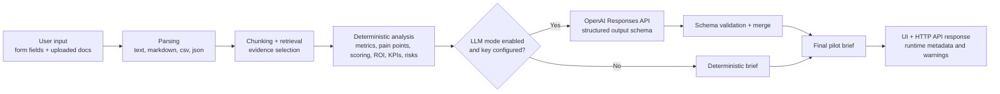

# Architecture

Ops Pilot is designed as a production-shaped planning agent instead of a raw chat demo. The core idea is simple: keep the business-case calculations deterministic, then let the LLM synthesize an executive-ready brief inside a constrained schema.

## Goals

- Turn messy workflow inputs into a pilot recommendation that a manager could actually review
- Preserve transparent ROI, KPI, and risk logic even when the final narrative is LLM-written
- Fail safely when an LLM provider is unavailable
- Keep the system easy to test locally without external dependencies

## Request Flow

## Key Components

## Intake and parsing

- [parsing.py](../src/ops_pilot/parsing.py) handles `.txt`, `.md`, `.csv`, and `.json` inputs.
- [models.py](../src/ops_pilot/models.py) defines the workflow case, evidence, ROI, KPI, risk, and runtime payloads.

## Retrieval layer

- [retrieval.py](../src/ops_pilot/retrieval.py) builds lightweight chunk-level retrieval using token overlap.
- Evidence snippets are preserved and attached to the brief so recommendations stay grounded.

## Deterministic planning layer

- [analysis.py](../src/ops_pilot/analysis.py) performs:
  - metric inference
  - clarifying question generation
  - pain-point extraction
  - opportunity scoring
  - ROI estimation
  - KPI and risk generation
  - rollout plan generation

This layer is the system of record for the business case. It is intentionally explicit and auditable.

## LLM synthesis layer

- [llm.py](../src/ops_pilot/llm.py) calls the OpenAI Responses API using structured outputs.
- The LLM does not own the numeric business logic. It refines the narrative and planning language within a JSON schema.
- The merge step preserves:
  - deterministic recommendation label
  - deterministic score
  - deterministic ROI values
  - retrieved evidence

## Runtime and fallback

- [config.py](../src/ops_pilot/config.py) supports `auto`, `llm`, and `deterministic` modes.
- [service.py](../src/ops_pilot/service.py) records runtime metadata such as:
  - trace ID
  - provider
  - model
  - request ID
  - fallback usage
  - warnings

If the LLM fails in `auto` mode, the app falls back to deterministic planning and returns a warning instead of failing the entire request.

## HTTP and UI

- [server.py](../src/ops_pilot/server.py) exposes:
  - `GET /api/health`
  - `POST /api/analyze`
- The browser UI in [static/index.html](../src/ops_pilot/static/index.html) and [static/app.js](../src/ops_pilot/static/app.js) shows the selected pipeline and any runtime warnings.

## Production-minded decisions

- Structured outputs instead of free-form generation
- Deterministic guardrails for ROI and recommendation scoring
- Human-in-the-loop rollout recommendations instead of autonomous actions
- Safe fallback path instead of hard dependency on a provider
- Standard-library networking to keep the system portable and inspectable

## Good next upgrades

- Replace token-overlap retrieval with embeddings and vector search
- Add request logging and prompt version tracking
- Persist case history and analyst feedback to a database
- Add authentication and per-team data isolation
- Add a formal evaluation dataset and regression checks for prompt changes
